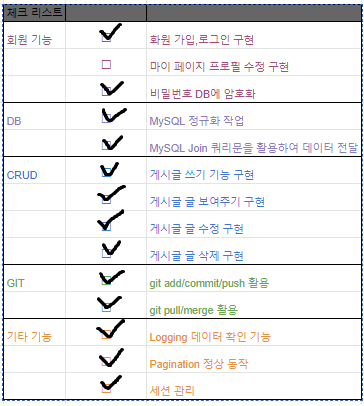
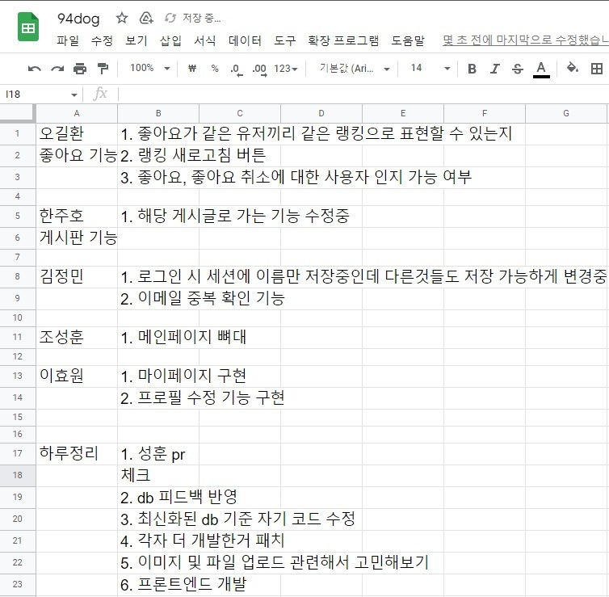
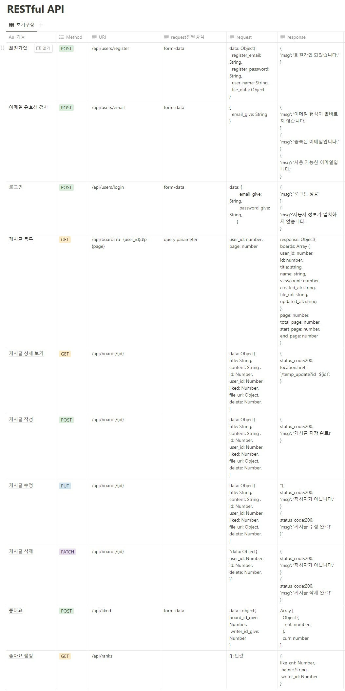

팀프로젝트#2 개띠구조대 - 뉴스피드
=======

|진행기간|12/02 ~ 12/09|
|-|-|
|서비스목표|94년생들의 정보 교환 및 소통을 위한 커뮤니티 좋아요 기능을 활용한 유용한 정보 찾기|

# 필수기능 체크리스트
</img>

# 개발환경
|목적|환경|
|-|-|
|서버|Flask|
|DB|MySQL|
|라이브러리|pymysql, flask_bcrypt, logging, hashlib , os|
|css프레임워크|부트스트랩|
  
# 역할구분
<!-- #### 오길환(팀장)
- 게시글 좋아요 기능, 좋아요 랭킹보드 기능
#### 김정민
- 로그인 & 회원가입 기능, 비밀번호 암호화, 로그인 세션 관리, 이미지 저장 기능
#### 이효원
- 마이페이지, 회원정보수정
#### 조성훈
- 게시판 페이지네이션, DB 모듈화
#### 한주호
- 게시판 CRUD, 이미지 저장 기능, 발표 및 시연 -->

|이름|구현기능|
|-|-|
|오길환(팀장)|게시글 좋아요 기능, 좋아요 랭킹보드 기능|
|김정민|로그인 & 회원가입 기능, 비밀번호 암호화, 로그인 세션 관리, 이미지 저장 기능|
|이효원|마이페이지, 회원정보수정|
|조성훈|게시판 페이지네이션, DB 모듈화|
|한주호|게시판 CRUD, 이미지 저장 기능, 발표 및 시연|

# 진행상황
* 12/02 - 팀 자기소개 및 S.A 의견 종합, 역할 분담
  * S.A (Starting Assignments) - [링크](https://4sii.tistory.com/145)   

* 12/03 ~ 12/04 - 각자 맡은 기능 구현

* 12/05
  * Github 활용 - issue, pr 기능 사용 시작
  * 회원가입, 로그인, 좋아요, 페이지네이션, 메인페이지 기능 초기 단계 완성 및 병합
  * 중간점검 진행  
</img>
* 12/06
  * 비밀번호 암호화 
  * 게시판 작성, 삭제, 수정, 출력 기능 완성 및 병합

* 12/07
  * 메인 페이지에 섹션별 구역 나눔. 게시판 섹션 추가 및 분리
  * 로그인 섹션 구현
  * 이미지 업로드 기능 추가 (회원가입, 게시판)
  * 게시글 좋아요 기능 구현
  * 회원가입 예외처리 추가
  * 메인 페이지 header, footer 추가
  * 게시판 기능 최적화
  * logging 시스템 구현
  * DB 모듈화

* 12/08
  * 좋아요 기능 최적화
  * 좋아요 랭킹보드 및 실시간 업데이트 기능 추가
  * 게시판 css 및 기능 오류 등 수정
  * 좋아요 랭킹보드 클릭시 해당 작성자의 게시글 목록 표시
  * API 문서 수정 및 그에 맞게 루트 수정 반영
  * 프로젝트 마무리, 발표 & 시연 준비

# 피드백 & 반영사항
추가 예정

# 문제 해결 & 추가 개선사항
#### * DB 모듈화
> DB 관련 데이터를 class화 시켜 문제 해결 - [링크](https://4sii.tistory.com/160)

#### * 서버 실행 시 두번 실행되는 문제
> 로깅 시스템 구현 중 알게된 서버 시작 시 두번 실행되는 현상 해결 - [링크](https://4sii.tistory.com/158)

#### * 이미지 파일 데이터를 서버에서 받지 못하는 현상
> form 태그를 formData로 만들어 넘기는 방법을 통해 해결 - [링크](https://4sii.tistory.com/155)

#### * DB 테이블 field 수정이나 테이블 삭제 시 DBeaver가 멈추는 현상
> 서로 종속된 FK 때문에 발생하는 현상으로 병목된 프로세스 kill 후 FK 종속을 없애는 방법 또는 FK 영향을 받지 않는 테이블 부터 삭제하는 방법을 통해 해결 - [링크](https://4sii.tistory.com/152)

# API
</img>

# 프로젝트 마무리 후 회고
오길환 - [블로그 링크](https://5kiran.tistory.com/38)  
조성훈 - [블로그 링크](https://4sii.tistory.com/164)  

# 시연 영상
 
